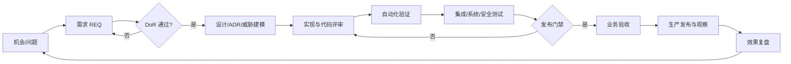

# CEO-BP 完整开发备忘录

| 属性 | 值 |
|---|---|
| 文档编号 | GOV-001 |
| 版本 | 0.1.0 |
| 状态 | Baseline |
| 生效日期 | 2026-07-30 |
| 适用范围 | 产品、架构、研发、测试、发布、验收与运维全过程 |
| 责任角色 | 项目负责人 |

## 1. 决策摘要

CEO-BP 不采用“一次性将全部后端改写为 Python”的路线，也不把现有数十个微服务永久保留后再叠加一层代理。基线方案是：

> **保留经准入验证的 Go 核心数据面，以 Python 重建控制面和经营决策业务面，通过防腐层逐步替换上游服务，最终收敛为 3—5 个主要后端部署单元。**

首期建议部署单元：

1. `platform-api`：Python/FastAPI 模块化单体，承载统一 API、权限编排和核心业务；
2. `semantic-engine`：优先复用 Go 能力，承载本体、业务知识网络、指标语义和语义查询；
3. `data-engine`：优先复用 Go 能力，承载数据连接、查询、联邦访问和大结果集传输；
4. `decision-worker`：Python 异步工作进程，承载预测、归因、RAG、报告和 Agent 任务；
5. 必要时独立的 `governance-service`，仅在负载、隔离或团队边界被数据证明后拆分。

## 2. 背景与已知约束

候选上游包括 `kweaver-core`、`kweaver-dip`、`kweaver-sdk` 和 `kweaver-admin`。源码审查表明它们提供了语义网络、数据接入、模型与 Agent、SDK 和管理工具等基础，但存在以下约束：

- 发布清单中的部分服务在已公开源码中缺失，不能假设可以完整重建；
- Core 与 DIP 存在部署、技能和语义模块重复，版本依赖有漂移；
- API 规范版本并不统一，尚缺可靠的跨服务契约门禁；
- 企业文档知识库只有 OCR、对象存储、Embedding、检索等散落能力，缺少统一知识库领域模型、权限、同步、引用和评估闭环；
- 现有“智能预测”偏向基于大模型的情景叙述，并非带回测和置信区间的统计预测引擎；
- 基础镜像、默认凭据、日志脱敏、第三方许可证和不可重现构建需要专项治理。

因此，任何上游代码进入主干前都必须经过组件准入，禁止直接全量合并。

## 3. 产品北极星与边界

### 3.1 北极星

让经营管理者从“看报表”升级为“基于统一事实和证据做决策，并持续验证决策效果”。

### 3.2 核心闭环

### 3.3 首期明确不做

- 不做通用 ERP、CRM 或完整数据开发平台的替代品；
- 不自动执行高风险经营动作；
- 不让大模型生成的叙述代替统计证据、审批或责任人判断；
- 不在没有合同、许可证和安全审计的前提下直接分发上游制品；
- 不为追求“微服务化”提前拆分模块化单体。

## 4. 领域能力地图

| 领域 | 首期能力 | 后续能力 |
|---|---|---|
| 组织与权限 | 租户、用户、组织、角色、数据范围、审计 | 细粒度策略和委托授权 |
| 数据访问 | 数据源注册、只读查询、数据集、质量状态 | 联邦优化、血缘和主动质量治理 |
| 指标中心 | 口径、版本、维度、单位、目标、责任人、审批 | 指标影响分析和自动口径校验 |
| 目标与驱动树 | 目标分解、指标绑定、驱动关系 | 因果模型和约束优化 |
| 经营分析 | 实际/预算/同期、下钻、贡献度、异常 | 多模型归因和因果实验 |
| 预测 | 基线模型、回测、误差、置信区间 | 组合预测、外生变量和漂移监测 |
| 场景模拟 | 假设、参数、方案比较、敏感性 | 优化建议与蒙特卡洛模拟 |
| 决策闭环 | 决策事项、证据快照、方案、审批、行动、结果 | 决策质量评分和组织学习 |
| 企业知识库 | 文档版本、解析、切片、混合检索、引用、ACL | 多源同步、评估集和知识生命周期 |
| 业务知识网络 | 对象、关系、事件、规则、指标语义 | 规则推理和跨域影响分析 |
| AI 助手 | 基于权限的问答、分析编排、引用与反馈 | 多 Agent 协作和人工审批节点 |

企业知识库、业务知识网络和决策档案必须分别建模：知识库存放文档证据，知识网络存放结构化业务对象与关系，决策档案存放一次决策的证据、审批、行动和结果；三者通过稳定标识关联，不混成一个表或一个索引。

## 5. 技术原则

1. **业务模块优先于服务拆分**：先建立清晰边界，再用实际负载和组织边界决定是否拆服务；
2. **契约优先**：外部 API 使用 OpenAPI 3.1，客户端由契约生成，破坏性变更必须版本化；
3. **端口与适配器**：业务代码只依赖 `SemanticEnginePort`、`DataEnginePort` 等抽象，不直接依赖上游 URL 和数据结构；
4. **数据面不绕行**：大文件和大结果集使用对象存储、流式下载或预签名地址，不无意义地经过 Python API；
5. **异步长任务**：解析、索引、预测、批量分析和报告使用队列/工作流，必须幂等、可重试、可取消和可观测；
6. **证据可重现**：分析记录保存数据快照/查询、指标版本、模型版本、参数和执行时间；
7. **安全默认开启**：最小权限、租户隔离、密钥外置、日志脱敏、依赖锁定和审计不可后补；
8. **AI 输出非事实源**：结论必须附引用、置信度和限制；高影响动作必须人工批准；
9. **可替换上游**：每个复用组件都有准入结论、契约测试和退出条件；
10. **减少部署单元是目标，不以消灭 Go 为目标**。

## 6. 交付阶段

| 阶段 | 目标 | 关键出口条件 |
|---|---|---|
| P0 基线与准入 | 仓库、治理、许可证/SBOM、组件可构建性和契约盘点 | 上游组件均有 Keep/Wrap/Rewrite/Reject 结论；风险有责任人与期限 |
| P1 平台骨架 | 身份权限、统一 API、适配器、审计、可观测、CI/CD | 最小纵向链路在集成环境可重复部署；契约和租户隔离测试通过 |
| P2 经营分析 MVP | 指标中心、驾驶舱、计划对比、下钻、分析事项 | 选定业务域真实数据 UAT 通过；口径、数据和证据可追溯 |
| P3 知识与决策闭环 | 企业知识库、引用问答、决策事项、行动和复盘 | 文档/切片 ACL 无越权；引用可定位；决策全过程可审计 |
| P4 高级分析 | 归因、统计预测、场景模拟和模型监控 | 预测有回测基准；方案可重现；业务验收阈值达标 |
| P5 收敛与规模化 | 替换缺失/高成本组件，减少部署单元，性能和灾备 | 3—5 个主要后端部署单元；容量、恢复和安全演练通过 |

每一阶段采用小版本迭代，不以“大爆炸切换”作为完成条件。详细范围见 [产品范围与路线图](../01-product/SCOPE_AND_ROADMAP.md)。

## 7. 全过程工作流

强制追踪链：

`目标/风险 → REQ → 设计/ADR → PR/提交 → 测试用例与报告 → 发布记录 → UAT → 运行指标/复盘`

任意节点缺少上游编号或下游证据，都不能声称“完成”。

## 8. 质量与发布底线

- 单元测试、契约测试、集成测试和关键 E2E 测试分层执行；
- 所有权限边界必须有正向与越权测试；
- 数据库迁移必须前向兼容、可演练并有恢复方案；
- Sev-1/Sev-2 缺陷为零才能生产发布；Sev-3 必须有业务接受和明确修复版本；
- 关键业务路径、数据一致性、RPO/RTO、性能、安全和可访问性达到该版本验收阈值；
- 制品必须可追溯到唯一提交，生成 SBOM，使用不可变版本，不使用浮动 `latest`；
- 发布后必须经过观察窗口，失败时按预案回滚或前滚修复。

## 9. 组织职责

采用角色而非人名固化职责：

- 项目负责人：范围、预算、优先级和最终发布决策；
- 产品负责人：业务问题、验收标准和价值验证；
- 架构负责人：边界、ADR、技术风险和上游准入；
- 开发负责人：实现质量、代码评审和工程效率；
- 测试负责人：独立测试策略、证据和质量结论；
- 安全/数据负责人：安全、隐私、数据分级、模型和许可证治理；
- 运维/发布负责人：环境、制品、变更、回滚、SLO 和事件响应；
- 业务验收负责人：真实场景 UAT 和业务上线签署。

项目启动时必须在项目配置或团队名单中把角色映射到具体人员并指定代理人。

## 10. 风险优先级

首批必须登记并处理的风险：

1. 上游服务源码缺失导致构建和维护不可控；
2. 第三方许可证、镜像来源和分发权不清晰；
3. 多套认证、Token、API 和部署脚本造成安全与维护漂移；
4. 指标口径和数据权限不统一导致错误决策；
5. 大模型幻觉或引用越权影响管理决策；
6. “预测”缺乏统计基线和回测，被误当作可靠数值预测；
7. 一次性重写范围过大，长期无法产生业务价值；
8. 上游包装层成为永久依赖，部署数量不降反升。

风险使用 [风险记录模板](../../templates/RISK_REGISTER.md) 管理；高风险未降级前不得进入生产。

## 11. 文档与记录要求

每个版本至少应产生：

- 已批准范围和需求追踪矩阵；
- 架构/接口/数据变更及 ADR；
- 测试计划、测试报告、缺陷清单和覆盖结论；
- SBOM、漏洞/许可证检查和安全例外；
- 发布说明、部署与回滚记录；
- UAT 记录、验收结论和遗留项；
- 上线观察和必要的复盘报告。

文档控制细则见 [文档控制规范](DOCUMENT_CONTROL.md)。

## 12. 基线变更机制

以下变更视为重大变更，必须新增 ADR 并由相应负责人批准：

- 改变后端语言策略、主要部署边界或数据所有权；
- 引入新的核心数据库、消息系统、工作流或 AI 模型供应商；
- 改变多租户、身份、权限、审计或数据保留策略；
- 改变企业知识库与业务知识网络的职责边界；
- 引入破坏性 API/数据迁移；
- 接受高风险许可证、安全或隐私例外。

本备忘录是后续开发和测试的默认依据。如具体文档与本备忘录冲突，以较新的已批准 ADR 和经同步修订的本备忘录为准，禁止长期保留互相矛盾的规范。
