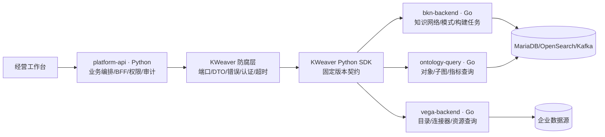

# KWeaver 重构实施蓝图

| 属性 | 值 |
|---|---|
| 文档编号 | ARC-003 |
| 版本 | 0.1.0 |
| 状态 | Approved for implementation |
| 生效日期 | 2026-07-31 |
| 上游基线 | `upstream/kweaver.lock.yaml` |

## 1. 目标纠偏

CEO-BP 是基于 KWeaver 内核重构的企业经营决策系统，不是开发状态看板，也不是用静态卡片模拟业务的演示系统。0.4.0 的决策矩阵仅保留为需求探索记录，不作为目标领域模型、页面结构或后端架构的继承基础。

目标产品必须让经营用户完成真实闭环：接入经营数据，建立业务知识网络，定义并查询指标，形成有证据的分析事项，提交决策，跟踪行动并复盘结果。页面只展示用户完成任务所需的信息；运行状态、依赖探测和测试结果仅进入受限运维入口。

## 2. 复用边界



处置结论：

- `bkn-backend`、`ontology-query`、`vega-backend` 保留 Go 实现，通过稳定接口封装；不以“统一语言”为理由重写；
- `platform-api` 使用 Python，拥有经营领域、流程、权限映射和审计，不代理大文件或大结果集；
- 优先复用 KWeaver Python SDK 0.8.4。SDK 未覆盖的接口先补 SDK 或生成客户端，不在业务模块散落手写 HTTP；
- DIP 的 Web/Studio 用于提取产品壳、知识建模交互和已有测试资产，不把 DIP 全量微服务部署进目标系统；
- Admin CLI 作为管理流程和契约参考，最终并入统一运维 CLI，不成为经营用户前端；
- 发布清单中缺少源码的服务保持拒绝状态，直至取得可构建源码、许可证和替代方案评审。

## 3. 知识能力边界

KWeaver 不缺“结构化知识网络”能力：BKN 已提供知识网络、对象类型、关系类型、动作类型、指标和构建任务，ontology-query 提供对象、属性、子图、指标及动作查询。

目标平台仍缺一套完整的“企业非结构化知识库”产品能力，包括文档版本、解析/切片、ACL 前置过滤、全文与向量混合检索、引用定位、检索评估、生命周期和删除传播。这部分由 Python `knowledge` 模块与异步 worker 建设，并通过绑定关系把文档证据关联到 BKN 对象、指标和决策；不得把文档库与 BKN 当成同一个模型。

## 4. 首个可交付纵向切片

首个切片按以下顺序实现，不再先制作宽而浅的首页：

1. 数据目录：用户创建/选择一个 Vega 数据源和资源，并完成连接验证；
2. 知识建模：用户创建一个 BKN，定义一个经营对象类型及其数据属性映射，触发构建并查看业务化结果；
3. 指标查询：在同一 BKN 中定义或选择一个指标，通过 ontology-query 返回真实结果和口径；
4. 分析事项：Python 业务模块保存问题、时间范围、指标快照、解释和证据引用；
5. 决策闭环：提交决策、审批、行动责任人/期限，并在后续周期写入结果与复盘。

完成标准是这五步共享同一租户、身份、业务对象和可追溯证据。任何一步使用硬编码示例数据，都只能作为显式开发夹具，不能进入验收环境。

## 5. 前端信息架构与按钮规则

经营用户主导航固定围绕任务：`数据目录`、`知识网络`、`指标中心`、`分析工作台`、`决策与行动`。系统配置和运行诊断放入独立的受限管理区。

每个交互按钮必须满足以下门禁：

- 对应一个已实现且可测试的用例，名称采用业务动词，例如“验证连接”“发布指标”“提交决策”；
- 点击前说明必要输入，点击后提供成功结果、失败原因和可恢复动作；
- 具有权限、幂等、审计和防重复提交策略；
- 不允许“开始分析”“AI 洞察”等无确定输入、输出和持久化结果的空操作；
- 后端用例尚未接通 KWeaver 或领域存储时，前端入口不进入发布版本。

## 6. 代码与部署结构

目标仓库逐步收敛为：

```text
apps/console/                  经营用户前端
services/platform-api/        Python 经营业务与防腐层
services/decision-worker/     Python 异步知识/分析任务
components/kweaver/           经准入的 Go 组件构建与补丁入口
upstream/kweaver.lock.yaml    上游不可变版本锁
contracts/                    对外 OpenAPI 与上游契约样本
deploy/                       单入口部署，公网只暴露 9006
docs/ + records/              设计、测试、发布和验收证据
```

在共享服务器 `121.196.149.55` 上，所有新增容器、网络、卷和内部端口必须使用 `ceobp-` 前缀；公网仅通过 9006 入口转发。Go 内核及 MariaDB、OpenSearch、Kafka 的资源基线未完成前，不部署到该服务器，也不复用其他项目的数据卷或网络。

## 7. 实施波次与失败条件

### P0：源码准入与可重现构建

完成版本锁、全模块单测、许可证/SBOM、配置清理和最小依赖图。若某组件无法由固定 SHA 构建，或必须依赖无源码服务才能提供首个切片，则从 Keep 降级为 Wrap/Replace 并提交 ADR。

### P1：防腐层

实现 BKN 列表/详情/创建、构建任务和 ontology 查询端口，使用假服务器做契约测试。失败条件是业务代码出现 KWeaver 原始字典、散落 URL、透传访问令牌或无限超时。

### P2：真实最小运行闭环

用隔离 Compose 启动最小依赖，完成数据源—BKN—指标查询集成测试。失败条件是依赖共享环境、人工改库、固定凭据或无法一键清理。

截至 2026-08-03，P2 基础闭环已完成：真实 Core 可创建、查询并持久化业务知识网络，运行栈、受控补丁和验收证据见 [TR-0.5.0-02](../../records/tests/0.5.0/TR-0.5.0-02.md)。对象类型、关系类型、指标和数据源仍属于后续纵向切片，未实现前不在界面提供构建操作。

### P3：前后端纵向切片

前后端共同交付第 4 节五步闭环，并形成测试、发布、UAT 和回滚记录。失败条件是页面只能展示静态概念、按钮无后端用例，或决策不能追溯到指标与证据快照。
