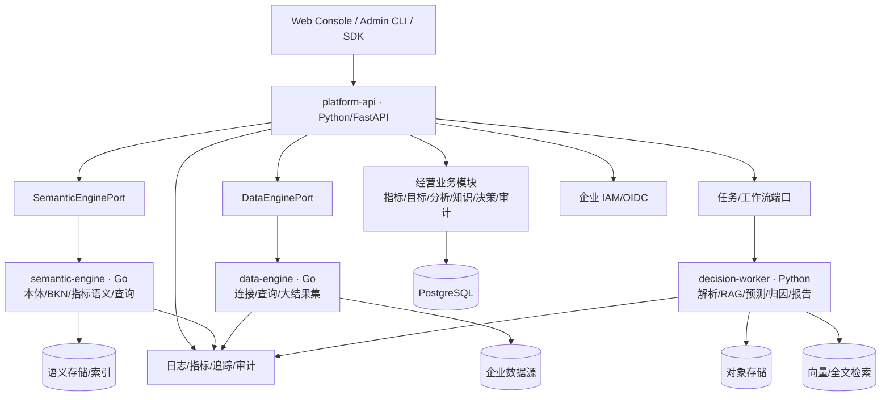

# 目标架构

| 属性 | 值 |
|---|---|
| 文档编号 | ARC-001 |
| 版本 | 0.1.0 |
| 状态 | Baseline |
| 生效日期 | 2026-07-30 |
| 责任角色 | 架构负责人 |

## 1. 总体结构



## 2. 部署边界

### platform-api

Python 模块化单体。内部模块必须有明确公开接口，禁止跨模块直接访问私有表。建议模块：

```text
identity, organization, metrics, goals, knowledge,
analysis, forecast, scenario, decisions, audit
```

适合 Python 的原因是业务变化快、数据/AI 生态成熟、团队可统一维护控制面。它不承担高吞吐联邦查询和大文件转发。

### semantic-engine

复用并收敛经验证的 Go 语义能力：本体、对象、关系、事件、指标语义、业务知识网络和语义查询。通过稳定端口隔离上游模型；如果源码缺失或维护成本长期过高，再按契约逐个重写。

### data-engine

复用经验证的数据连接、查询和结果传输能力。负责凭据引用、连接测试、查询限额、取消、超时和数据源适配，不拥有经营业务规则。

### decision-worker

Python 异步进程，可按任务类型独立扩缩容。负责文档解析/索引、预测/回测、归因、场景计算、RAG 和报告生成。每个任务必须有唯一 ID、输入版本、幂等键、进度、重试策略和结果引用。

## 3. 数据所有权

| 数据 | 权威所有者 | 说明 |
|---|---|---|
| 用户、租户、角色 | IAM / identity 模块 | 不复制口令，只保存外部主体映射 |
| 指标定义和版本 | metrics 模块 | 发布版本不可原地覆盖 |
| 本体、业务对象关系 | semantic-engine | platform-api 通过端口访问 |
| 数据源元数据/查询 | data-engine | 密钥保存于密钥系统，不入业务库 |
| 知识库/文档元数据 | knowledge 模块 | 原文在对象存储，索引保存引用 |
| 分析/预测/场景运行 | 对应业务模块 | 保存输入、模型、参数和结果版本 |
| 决策、审批、行动、复盘 | decisions 模块 | 证据使用不可变快照或稳定引用 |
| 审计事件 | audit 模块/审计存储 | 仅追加，限制管理员篡改能力 |

每类数据只能有一个权威写入方。跨服务复制用于查询时必须声明同步方式、一致性级别、延迟指标和纠错机制。

## 4. 企业知识库设计

最低领域对象：

- `KnowledgeBase`：用途、租户、可见范围、索引策略；
- `Document` / `DocumentVersion`：来源、校验和、状态、有效期、保密级别；
- `DocumentChunk`：定位、文本、结构、页码/段落、权限继承；
- `IngestionJob`：解析、切片、索引、失败、重试和去重；
- `IndexBinding`：全文/向量索引版本与嵌入模型；
- `AclBinding`：主体、范围、规则和来源；
- `RetrievalLog` / `KnowledgeFeedback`：查询、候选、重排、引用和反馈。

检索采用“ACL 前置过滤 + 关键词/向量混合召回 + 可选重排 + 引用定位”。Embedding 不是权限边界；禁止召回后才依赖大模型隐藏无权内容。

## 5. API 与集成

- 外部同步 API：REST + OpenAPI 3.1；
- 内部高频且确有收益时可用 gRPC，但仍需版本化契约；
- 长任务：队列或工作流，API 返回 `202 + job_id`；
- 文件：对象存储预签名上传/下载；
- 事件：使用事务发件箱或等价机制，消费者必须幂等；
- 错误：统一机器码、用户消息、追踪 ID 和可重试标志；
- SDK：从已发布契约生成 TypeScript/Python 客户端，禁止手工复制 DTO。

示例端口：

```python
class SemanticEnginePort(Protocol):
    async def query_metric(self, request: MetricQuery) -> MetricResult: ...
    async def search_objects(self, request: ObjectSearch) -> ObjectPage: ...
    async def get_subgraph(self, request: SubgraphQuery) -> BusinessGraph: ...
```

上游字段、认证、分页和错误转换仅存在于适配器层。

## 6. 非功能基线

具体数值由试点容量测试确认并写入版本验收标准。所有版本至少定义：

- 可用性 SLO、关键路径延迟和并发容量；
- 数据新鲜度、查询超时和长任务完成时限；
- RPO/RTO、备份保留和恢复演练频率；
- 租户隔离、授权、审计和密钥轮换；
- 模型/检索质量、成本和降级策略；
- 浏览器支持、可访问性和导出限制。

## 7. 架构演进约束

- 只有模块需要独立扩缩容、故障隔离、技术栈或团队所有权且数据证明收益时才拆服务；
- 新增部署单元必须给出替代方案、总拥有成本和退出条件；
- 不允许 `platform-api` 成为无业务边界的透传网关；
- 不允许业务模块直接连接其他服务数据库；
- 不允许长期双写但没有对账指标和退出日期。
